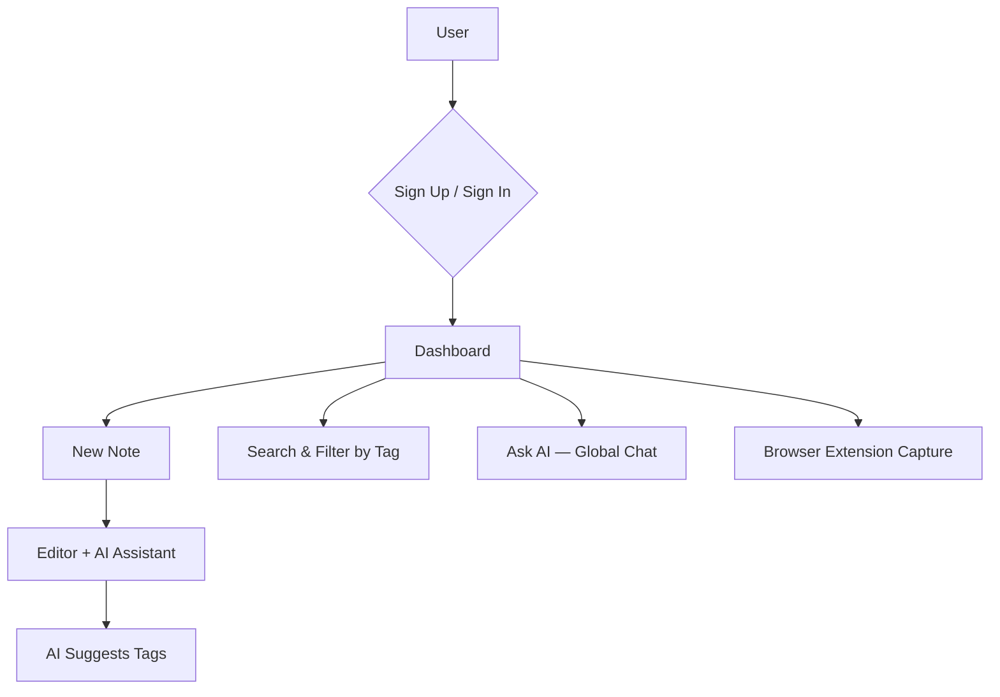
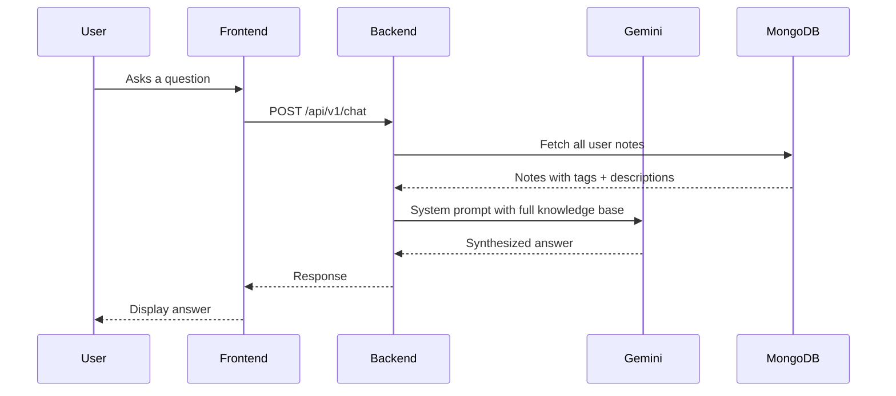
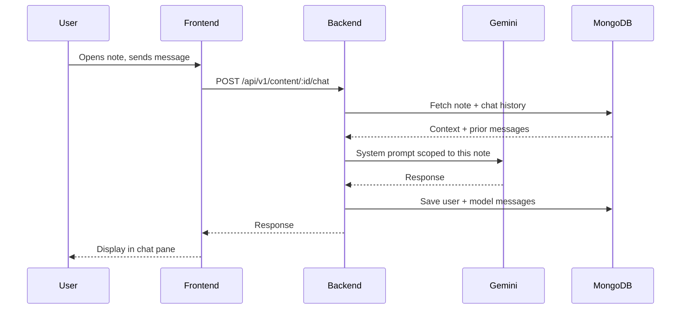
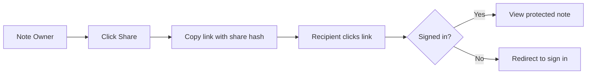

# MemoryPal — Your AI-Powered Second Brain

MemoryPal is a distraction-free note-taking app that lets you capture ideas, curate links, and actually get things back out — powered by Google Gemini AI across your entire knowledge base.

## Features

- **Global AI Chat** — Ask questions across all your notes at once. "What did I save about fundraising?" → synthesized answer from your entire second brain.
- **Per-Note AI Assistant** — Every note has its own AI companion that knows its specific context, with full chat history.
- **Search** — Instant search across note titles, descriptions, and tags as you type.
- **Tags + Smart Filtering** — Add tags manually or let AI suggest them. Filter your dashboard by tag in one click.
- **Browser Extension** — Right-click any page → "Save to MemoryPal". Auto-fills title and URL. Works on any site.
- **Secure Sharing** — One-click share links protected behind authentication.
- **Distraction-Free Editor** — Split-pane layout: write on the left, chat with AI on the right.

## Application Flows

### User Journey


### Global AI Chat


### Per-Note AI Chat


### Note Sharing


## Tech Stack

| Layer | Technology |
|---|---|
| Frontend | React 18 + Vite + TypeScript + Tailwind CSS |
| Backend | Node.js + Express 5 + TypeScript |
| Database | MongoDB + Mongoose |
| Auth | JWT (7-day expiry) + bcrypt |
| AI | Google Gemini 2.0 Flash (with 2.5 / 1.5 fallback) |
| Browser Extension | Chrome Manifest V3 (plain JS) |

## Project Structure

```
MemoryPal/
├── backend/          # Express API
│   └── src/
│       ├── index.ts  # All routes
│       ├── db.ts     # Mongoose models (User, Content, Chat, Tag)
│       ├── middleware.ts
│       └── config.ts
├── frontend/         # React + Vite app
│   └── src/
│       ├── pages/    # Dashboard, Signin, Signup, SharedNote
│       ├── components/  # Card, CreateContentModal, GlobalChatModal, ChatSection, ...
│       └── hooks/    # useContent
└── extension/        # Chrome browser extension
    ├── manifest.json
    ├── popup.html
    ├── popup.js
    └── background.js
```

## API Reference

| Method | Endpoint | Description |
|---|---|---|
| POST | `/api/v1/signup` | Register |
| POST | `/api/v1/signin` | Login → JWT |
| GET | `/api/v1/content` | List notes (supports `?q=` search, `?tag=` filter) |
| POST | `/api/v1/content` | Create note (title, links, description, tags) |
| PUT | `/api/v1/content/:id` | Update note |
| DELETE | `/api/v1/content` | Delete note |
| GET | `/api/v1/tags` | List all tags used by the user |
| POST | `/api/v1/suggest-tags` | AI-generated tag suggestions |
| POST | `/api/v1/chat` | Global AI chat across all notes |
| GET | `/api/v1/content/:id/chat` | Fetch per-note chat history |
| POST | `/api/v1/content/:id/chat` | Send message to per-note AI |
| GET | `/api/v1/shared/:hash` | View a shared note |

## Deployment

### Backend (Render / Railway)

Set these environment variables:

```
MONGO_URL=mongodb+srv://...
JWT_PASSWORD=your-secret-key
GEMINI_API_KEY=your-gemini-key
FRONTEND_URL=https://your-frontend.vercel.app
PORT=3000
```

### Frontend (Vercel)

1. Set `BACKEND_URL` in `frontend/src/config.ts` to your backend URL.
2. `npm run build` → deploy the `dist/` folder.

### Browser Extension (Chrome)

1. Go to `chrome://extensions`
2. Enable **Developer mode**
3. Click **Load unpacked** → select the `extension/` folder
4. The MemoryPal icon appears in your toolbar. Right-click any page to save instantly.
