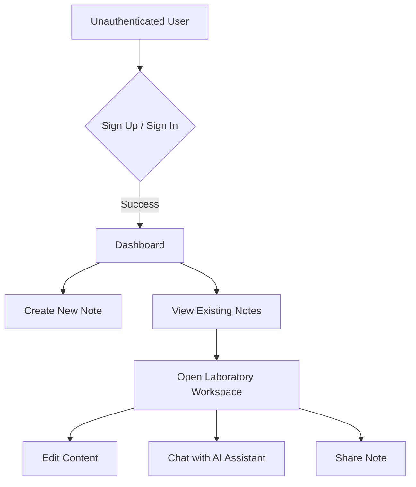
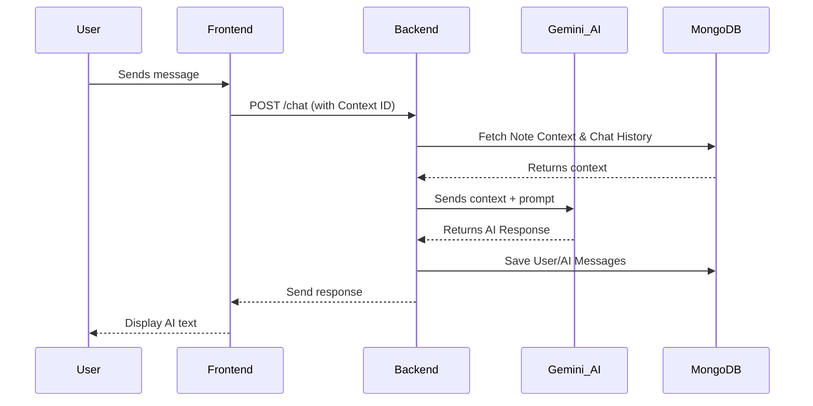
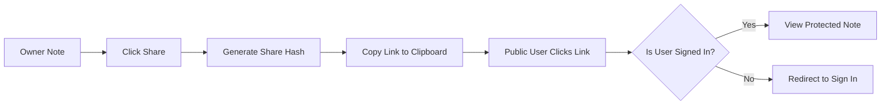

# MemoryPal - Your Digital Second Brain 🧠

MemoryPal is a premium, distraction-free laboratory for your thoughts. Capture notes, curate links, and chat with your personal AI companion—all in one place.

## 🚀 Key Features

- **Personal AI Assistant**: Every note gets its own AI companion that understands its specific context.
- **Distraction-Free Editor**: A split-pane "Laboratory" layout for writing and brainstorming.
- **Secure Sharing**: One-click sharing with protected, authenticated-only access.
- **Context Isolation**: AI chats are isolated per note, ensuring your data remains private and relevant.
- **Modern Tech**: Built with React, TypeScript, and Google's Gemini 2.0.

## 📊 Application Workflows

### 1. User Journey Flow

### 2. AI Chat Architecture

### 3. Secure Note Sharing

## 🛠️ Tech Stack

### Frontend
- **React + Vite**: High-performance UI.
- **Tailwind CSS**: Premium minimalist styling.
- **Axios**: Secure API communication.

### Backend
- **Node.js & Express**: Scalable server architecture.
- **TypeScript**: End-to-end type safety.
- **MongoDB + Mongoose**: Real-time document storage.
- **Gemini 2.0 Flash**: State-of-the-art AI integration.

## 📦 Deployment Guide

### Backend (Railway/Render)
1. Set `MONGO_URL`, `JWT_PASSWORD`, and `GEMINI_API_KEY` in environment variables.
2. Ensure `PORT` is exposed.

### Frontend (Vercel)
1. Update `BACKEND_URL` in `src/config.ts`.
2. Run `npm run build` and deploy the `dist` folder.

---
Built with ❤️ for the future of knowledge management.